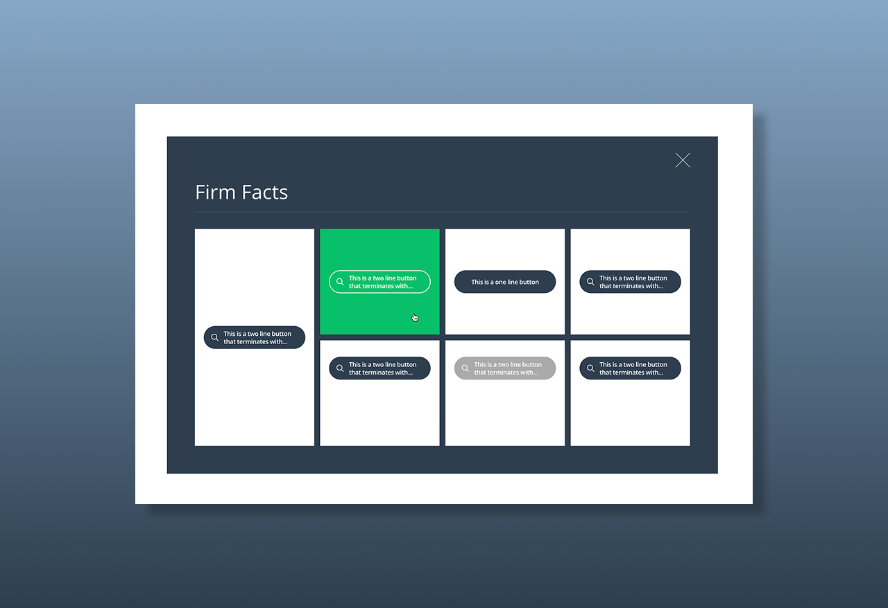

# Styling Challenge

Project developed for a technical challenge to test my React skills.

I received a document describing all the requirements and specifications of what should be implemented in this challenge.

This was the result following all the specifications received.

<p align="left">
  
</p>

## Installation:

To run the project locally, follow the steps below:

### 1. Prerequisites:

Before you begin, make sure you have installed:

- <a href="https://nodejs.org/en" target="_blank">Node.js</a> (LTS version recommended)

- <a href="https://www.npmjs.com/" target="_blank">npm</a> or <a href="https://yarnpkg.com/" target="_blank">yarn</a>

### 2. Clone the repository:

```sh
git clone https://github.com/leandrofc/styling-challenge.git
```

### 3. Access the project directory:

```sh
cd styling-challenge
```

### 4. Install the dependencies::

```sh
npm install
```

or

```sh
yarn install
```

### 5. Running the project:

```sh
npm run dev
```


or

```sh
yarn dev
```